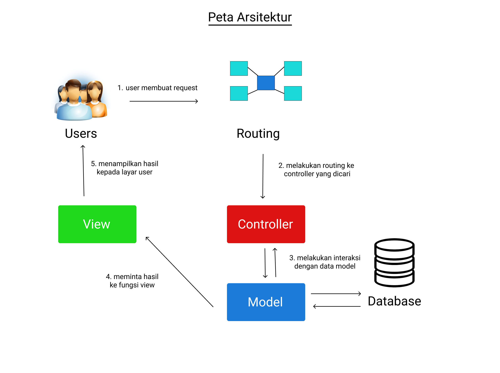

 <h1></h1>
  
 <b>Pengembangan Sistem Berorientasi Objek (KOM334) 
 Kelompok 6 Praktikum 2</b>
   
 <b> Asisten Praktikum: </b>  
 1. Kak Indah Puspita  
   
 <b> Anggota Kelompok: </b>
 <table>
    <tr>
      <th></th>
      <th>Nama</th>
      <th>NIM</th>
      <th>Role</th>
    </tr>
    <tr>
      <td>1</td>
      <td>Berly Setiawan</td>
      <td>G64180044</td>
      <td>Back-End Developer</td>
    </tr>
    <tr>
      <td>2</td>
      <td>Cristmas Anggario</td>
      <td>G64180058</td>
      <td>Back-End Developer</td>
    </tr>
    <tr>
      <td>3</td>
      <td>Arrazzaq Adrian</td>
      <td>G64180109</td>
      <td>Project Manager</td>
    </tr>
    <tr>
      <td>4</td>
      <td>Yudha Berliandi</td>
      <td>G64180110</td>
      <td>Frontend Developer</td>
    </tr>
    <tr>
      <td>4</td>
      <td>Denny LIndawati Sinurat</td>
      <td>G64180103</td>
      <td>UI/UX Designer</td>
    </tr>
  </table>

## Deskripsi singkat aplikasi
[`^ Kembali Keatas ^`](#)

IPB Siawak (Sistem Informasi Anggota Ormawa dan Kepanitiaan) adalah sebuah sistem informasi perekrutan anggota ormawa atau kepanitiaan yang terintegrasi dengan Simak, Simawa dan Simormawa.

## User analysis
[`^ Kembali Keatas ^`](#)
   #### User story
 * Saya sebagai ketua ormawa/kepanitiaan, saya membutuhkan sistem yang bisa diakses mahasiswa lain untuk penerimaan keanggotaan ormawa agar saya tidak menginput anggota satu persatu.
 * Saya sebagai ketua ormawa/kepanitiaan bisa memposting open recruitment mereka dan mengatur kriteria mahasiswa yang dapat melamar.
 * Saya sebagai ketua ormawa/kepanitiaan bisa melihat siapa saja pendaftar dan kemudian dapat memilih menerima atau menolak calon pendaftar tersebut.
 * Saya sebagai mahasiswa bisa melihat ormawa/kepanitiaan mana yang sedang membuka open recruitment dan mereka cocok dengan kriteria saya.
 * Saya sebagai mahasiswa, saya ingin mengetahui jadwal pendaftaran ormawa/kepanitiaan yang ada di IPB supaya bisa saya ikuti, sehingga saya bisa mengikuti timeline pendaftaran ormawa secara cepat dan aktual. 
 * Saya sebagai mahasiswa yang ingin melamar tidak perlu lagi data data umum lagi, jadi tinggal mengisi data dan syarat” tambahan saja.
 * Saya sebagai mahasiswa, ketika saya mengikuti ormawa/kepanitiaan saya ingin keanggotaan saya terverifikasi, sehingga di akhir saya tidak perlu mengajukannya lagi untuk SKPI.
   
## Ruang Lingkup Pengembangan
[`^ Kembali Keatas ^`](#)

Aplikasi yang dirancang adalah sistem aplikasi berbasis web. Web IPB Siawak memiliki  fitur pencatatan anggota ormawa, menampilkan ormawa dan kepanitiaan yang sedang  oprec. Web IPB SIAWAK (Sistem Informasi Anggota Ormawa dan Kepanitiaan) disimpan dalam database dengan operasi insert, delete, dan view data yang ditampilkan dalam web. Data yang di input berdasarkan mahasiswa yang melakukan pendaftaran sehingga datanya pun tersimpan di dalam database.

## Spesifikasi teknis lingkungan pengembangan
[`^ Kembali Keatas ^`](#)

  ### Software
   - Visual Studio Code 1.56.2
   - Github
   - Git Bash 2.32.0
   - Trello
   - Composer 2.1.3
   - Figma
   - XAMPP 8.0.6
   - MAMP 8.0.7
   - Draw.io
  
  ### Hardware
   - AMD Ryzen 5 3500U with Radeon Vega Mobile Gfx (8 CPUs), ~2.1GHz
   - 8 GB RAM
   
  ### Tech Stack
   - Laravel 8.16.1
   - Bootstrap v5.0.1
   - MySQL 8.0.25
  
## Konsep OOP yang digunakan
[`^ Kembali Keatas ^`](#) 
#### 1.	Abstrak Class
  * Kelas merupakan deskripsi abstrak informasi dan tingkah laku dari sekumpulan data.
  * Kelas dapat diilustrasikan sebagai suatu cetak biru(blueprint) atau prototipe yang digunakan untuk menciptakan objek.
  * Kelas merupakan tipe data bagi objek yang mengenkapsulasi data dan operasi pada data dalam suatu unit tunggal.
  * Kelas mendefinisikan suatu struktur yang terdiri atas data kelas (data field), prosedur atau fungsi (method), dan sifat kelas (property).
  
#### 2.	Encapsulation
  * Encapsulation memungkinkan sebuah atribut yang hanya dapat diakses oleh sebuah class untuk diakses oleh class lain menggunakan sebuah method
  * Encapsulation merupakan kombinasi data dan fungsionalitas dalam sebuah unit tunggal sebagai bentuk untuk menyembunyikan detail informasi.
  * Enkapsulation menekankan pada antarmuka suatu kelas, atau dengan kata lain bagaimana menggunakan objek kelas tertentu.
  * Proses enkapsulation memudahkan kita untuk menggunakan sebuah objek dari suatu kelas karena kita tidak perlu mengetahui segala hal secara rinci.

## Tipe desain pengembangan yang digunakan (Pattern/Anti Pattern)
[`^ Kembali Keatas ^`](#)  

Dalam mengembangkan IPB SIAWAK (Sistem Informasi Anggota Ormawa dan Kepanitiaan), kelompok kami menggunakan design pattern MVC (Model View Controller) yang dimana design pattern ini membagi suatu aplikasi menjadi tiga bagian yang saling terhubung yaitu model (database), view (tampilan/ui) dan controller (interaksi model dan view). 

#### Model
   Model bertanggung jawab untuk mengambil data dan mengubahnya menjadi data yang lebih bermakna yang dapat dikelola oleh lapisan aplikasi yang lain dan mengirimkannya kembali ke lapisan yang sesuai.

Penerapan pada sistem :

1.	Model Ketua Ormawa : Pada model ketua ormawa terdapat informasi mengenai nama dan nim ketua ormawa di IPB University yang akan dibutuhkan ketika ketua ormawa tersebut akan membuka open recruitment dan hal lainnya di IPB Siawak
2.	Model Mahasiswa : Pada model mahasiswa terdapat informasi mengenai nama dan nim mahasiswa pendaftar yang dibutuhkan ketika mahasiswa akan melakukan pendaftaran
3.	Model Penerimaan Anggota : Pada model penerimaan anggota terdapat informasi mengenai penerimaan anggota yang dilakukan oleh ketua ormawa dan informasi pelamar
4.	Model Jenis Pendaftaran (Kepanitiaan dan Ormawa) : Pada model jenis Pendaftaran terdapat format informasi yang akan diiisi oleh pendaftar/pelamar
	

#### View
   View mendefinisikan dengan tepat apa yang disajikan kepada pengguna. Biasanya, Controller meneruskan data ke setiap Tampilan. Tampilan juga mengumpulkan data dari pengguna. Di sini kami menggunakan bahasa pemrograman PHP untuk tampilan.

Penerapan di sistem : 

1. Landing Page
    View landing page merupakan tampilan awal dari web IPB Siawak, view ini menampilkan kata mulai sekarang, logo IPB Siawak, serta pilihan untuk login.
2. Login Page
    View login page menampilkan format yang harus diisi oleh pengguna (ketua ormawa dan mahasiswa) yaitu email IPB pengguna dan kata sandi.
3. Pendaftaran Ormawa/Kepanitiaan 
    View pendaftaran ormawa/kepanitiaan menampilkan informasi terkait ormawa/kepanitiaan yang sedang oprec. 
5.	Penerimaan anggota   
    View penerimaan anggota menampilkan informasi pendaftar yang akan diseleksi

#### Controller 
   Controller merupakan bagian yang menjembatani model dan view. Controller berisi perintah-perintah yang berfungsi untuk memproses suatu data dan mengirimkannya ke halaman web.
Penerapan pada sistem :
1.	Auth Controller Auth controller digunakan untuk mengatur autentikasi saat login sehingga hanya yang menjadi admin yang bisa mengakses sistem perpustakaan
2.	Controller untuk setiap model

## Hasil dan pembahasan
[`^ Kembali Keatas ^`](#)
  * Use case diagram
     
    
  * Activity diagram
     
    
  * Class diagram 
     
    
  * Entity Relationship Diagram 
     
    
  * Arsitektur sistem 
     
    
    
  * Fungsi utama yang dikembangkan
  * Fungsi CRUD

## Hasil implementasi
[`^ Kembali Keatas ^`](#)
 
 * Screenshot sistem
  
 * Link aplikasi (jika sudah di deploy)

## Saran untuk pengembangan selanjutnya
    Pengembangan sistem SIAWAK ini berjalan dengan keterbatasan 
[`^ Kembali Keatas ^`](#)      

## Developer dan job desc
[`^ Kembali Keatas ^`](#)
### Project Manager 

| Nama                 | NIM           |
| -------------------- |:-------------:| 
| Berly Setiawan       | G64180044     |

### Frontend Developer

| Nama                    | NIM           | Job Desk                     |
| ----------------------- |:-------------:| :----------------------------|
| Berly Setiawan          | G64180044     |           |
| Cristmas Anggario       | G64180058     |           |
| Arrazzaq Adrian         | G64180109     |           |
| Yudha Berliandi         | G64180110     |           |
| Denny Lindawati Sinurat | G64180103     |           |

### Backend Developer

| Nama                    | NIM           | Job Desk                     |
| ----------------------- |:-------------:| :----------------------------|
| Berly Setiawan          | G64180044     |  |
| Cristmas Anggario       | G64180058     |  |
| Arrazzaq Adrian         | G64180109     |  |
| Yudha Berliandi         | G64180110     |  |
| Denny Lindawati Sinurat | G64180103     |  |

   

# Akun Dummy
`Akun Ketua`
Email : arraz@apps.ipb.ac.id / rapi@apps.ipb.ac.id
Pass : 12345

`Akun Mahasiswa`
Email : berly@apps.ipb.ac.id / ebuy@apps.ipb.ac.id
Pass : 12345

## Step Before Coding
- Clone your project `git clone https://github.com/BerlySet/PSBO.git`
- Go to the folder application using `cd` command on your cmd or terminal
- Run `composer install` on your cmd or terminal
- Copy .env.example file to .env on the root folder. You can type `copy .env.example .env` if using command prompt Windows or `cp .env.example .env` if using terminal, Ubuntu
- Open `phpMyAdmin` and create database name `ipb-siawak`
- Open your .env file and change the database name `(DB_DATABASE)` to `ipb-siawak`, username `(DB_USERNAME)` and password `(DB_PASSWORD)` field correspond to your configuration. By default, the username is root and you can leave the password field empty. (This is for Xampp) By default, the username is root and password is also root. (This is for Lamp or Mamp)
- Run `php artisan key:generate`
- Run `php artisan migrate`
- Run `php artisan db:seed`
- Run `php artisan serve`

## Step If Database or Migration or Seeder Changed
- Make sure XAMPP apache and MySQL active
- Run `php artisan migrate:fresh`, Your table in database will be regenerated
- Run `php artisan db:seed`

